# IMC Prosperity 4 — 算法交易参赛复盘

<div align="center">

  <a href="https://prosperity.imc.com/leaderboard">
    
  </a>
  <a href="https://prosperity.imc.com/leaderboard">
    
  </a>
  <a href="https://prosperity.imc.com/leaderboard">
    
  </a>

</div>

> 这是一个 **方法论展示型** 仓库,不是冠军 highlight reel。我们**最终总排名93名，算法交易排名96名，Top 0.5%** (详见下方排名总览)。开源的目的不是炫耀名次,而是完整记录我们**面对一个陌生市场如何从零开始观察、提假设、建模、回测、复盘**——包括哪些环节做对了、哪些环节因为先入为主而错失 alpha。
>
> 
> **如果时间有限，建议直接读 [Round 1](#round-1--单资产趋势--单资产均值回归) 与 [Round 5](#round-5--50-资产复杂跨资产结构) 的复盘。** Round 5 尤其值得读：我们已经通过三种方法独立验证了一个微观结构现象的数学原理，却因两条固有的先入为主判断“此处无 alpha”。赛后的归因重构表明，如果当时部署了这个单一的 lattice-reversal（网格反转）信号，很可能会将我们的算法排名从第 96 名直接拉升至 Top-15 区间。

---

## 🌌 队伍

<div align="center">
  <a href="prosperity/assets/images/DarkForestHunter_TeamName.png">
    
  </a>
</div>

<details>
  <summary align="center">
    <b>🏹 [点击查看团队海报 / CLICK TO VIEW TEAM POSTER]</b>
  </summary>
  <p align="center">
    <br>
    
    <br>
    <i>"The universe is a dark forest. Every civilization is an armed hunter..."</i>
  </p>
</details>

<br>

<table>
<tr>
<td width="180" align="center">
<br/>
<b>Haoqing Liu (Leo)</b>
</td>
<td>
<b>策略设计 · 回测框架 · 复盘可视化</b><br/><br/>
负责整体策略设计、微观结构分析、自建回测框架与超参数搜索、复盘可视化模块的搭建、以及主要的统计建模工作。<br/><br/>
🔗 <a href="https://www.linkedin.com/in/haoqing-liu-2232b2293/">LinkedIn</a> · 📧 liuhaoqing.leo@gmail.com · 💻 <a href="https://github.com/Leo-Hawking">GitHub</a>
</td>
</tr>
<tr>
<td width="180" align="center">
<br/>
<b>Zhuoqin Peng (Mike)</b>
</td>
<td>
<b>数据分析 · 跨资产关系挖掘</b><br/><br/>
负责跨资产关系的统计探索与验证。Round 5 的核心发现——PEBBLE 组的负相关结构、SNACK 组的正负相关与反转关系——主要由其在 50 资产收益率相关系数矩阵上的分析驱动。<br/><br/>
🔗 <a href="https://www.linkedin.com/in/mike-peng-244237245/">LinkedIn</a>
</td>
</tr>
</table>

---

## 比赛简介

IMC Prosperity 4 由 IMC Trading 主办，分为算法交易与手动交易两部分，本仓库专注算法交易。

规则是基于主办方提供的三天微观行情（订单簿快照 + 成交记录），编写 Python 策略文件并提交至官方撮合系统在线运行，目标为最大化 PnL。

赛制为 1 个 Tutorial 预备轮 + 5 个正式轮：Phase 1（Round 1–2，每轮 72h）与 Phase 2（Round 3–5，每轮 48h），两个 Phase 之间排名重置。

本次比赛总参赛队伍 **18,803** 个。

<div align="center">
  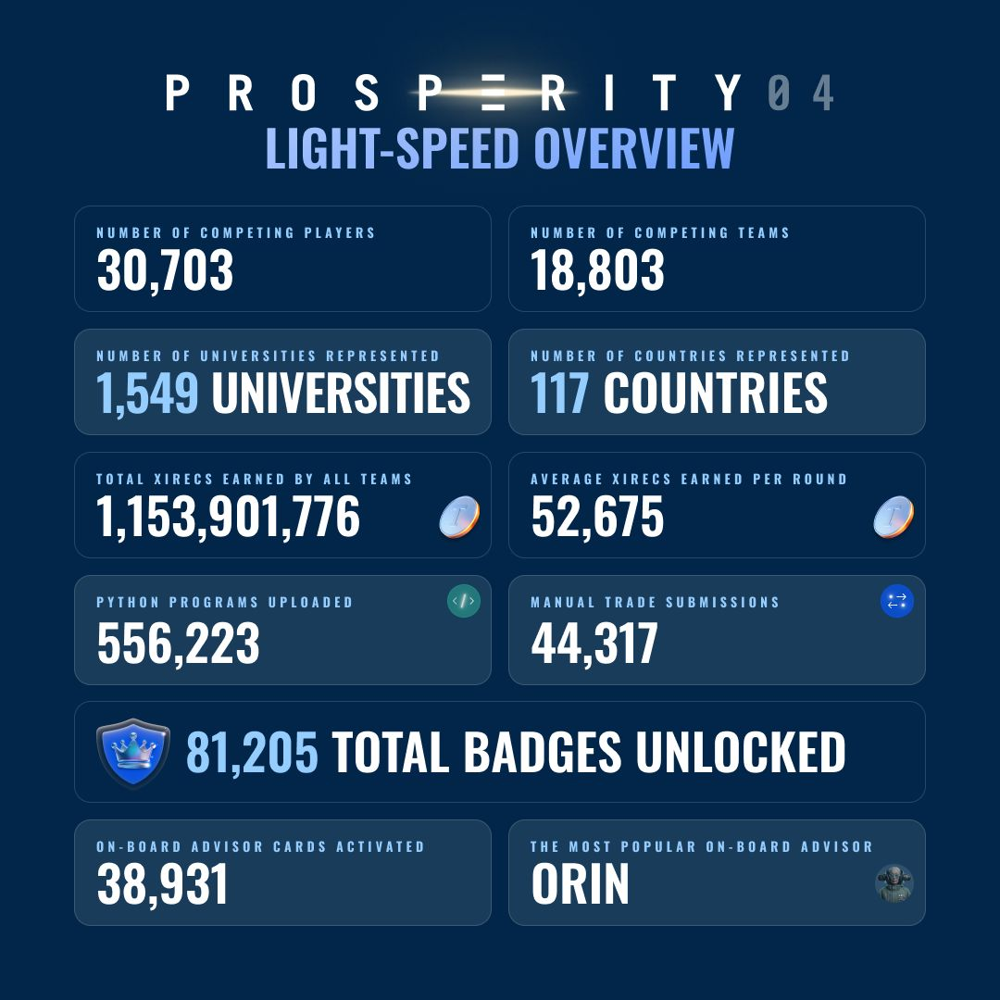
</div>

官方资料：<https://imc-prosperity.notion.site/prosperity-4-wiki>

---

## 排名总览

| 轮次 | 市场主题 | 算法交易名次 | 关键心得 |
|---|---|---|---|
| Round 0 | Tutorial(撮合机制摸底) | — | 通过探针单确认"无队列、bot 仅吃 best、主动 take 可跨价"等基础机制 |
| Round 1 | 单资产趋势 + 单资产均值回归 | **170** | 双层 fair price 校正方法成型;ASH 极端偏离区段未做加码,被头部队伍硬编码逻辑拉开差距 |
| Round 2 | 同 Round 1 + 出价竞拍博弈 | **77** | 出价对冲不确定性;ASH 均值发生漂移,我们的保守仓位管理反而占优 |
| Round 3 | 期权(10 档行权价) + 现货 | **95** | 放弃了波动率/配对方案,全资产统一做均值回归——可解释性占优,但精度让步 |
| Round 4 | 与 Round 3 同市场 + 披露 bot 名 | **132** | 分桶分析筛出 Mark 14 / Mark 55 两个 informed bot;策略迁移惯性导致下滑 |
| Round 5 | 50 资产,复杂跨资产结构 | **96** | 证实"内外层订单分别生成"猜想;遗漏了"整百弹跳"区段的高频均值回归 alpha |

---

## ⚠️ 关于代码可运行性的说明

仓库内大部分代码是**比赛实战时直接使用的版本**,因为时间紧张,我们没有专门为开源展示做整理与重构,**直接运行可能需要修复路径与依赖。**(路径硬编码、依赖缺失、调试代码残留等)。

如果您是潜在雇主或合作方,**这个仓库的核心价值在于策略思路、研究文档(`*.md`)、复盘可视化框架,以及每轮的方法论叙述**,而非"开箱即用"的代码库。具体策略实现细节可在面试中详谈。

---

## 目录

- [工作流](#工作流)
- [仓库地图](#仓库地图)
- [基建与工具](#基建与工具)
- [分轮纪实](#分轮纪实)
  - [Round 0 — Tutorial](#round-0--tutorial)
  - [Round 1 — 单资产趋势 + 单资产均值回归](#round-1--单资产趋势--单资产均值回归)
  - [Round 2 — 加入出价竞拍博弈](#round-2--加入出价竞拍博弈)
  - [Round 3 — 期权 + 现货](#round-3--期权--现货)
  - [Round 4 — 披露 Bot 名,跟单挖掘](#round-4--披露-bot-名跟单挖掘)
  - [Round 5 — 50 资产,复杂跨资产结构](#round-5--50-资产复杂跨资产结构)
- [总复盘](#总复盘)

---

## 工作流

我们参考了往届公开的优秀案例(主要是 [TimoDiehm/imc-prosperity-3](https://github.com/TimoDiehm/imc-prosperity-3))。整体流程是一个 **"探针 → 可视化 → 假设 → 规范文档 → 实现 → 回测复盘"** 的循环:

1. **探针策略** — 每轮开始,先提交几个空策略 + 机械网格挂单,目的是摸清当前市场的撮合机制(队列、tick、跨价行为等)。代码见 `prosperity/round0trade/`。

2. **高密度可视化** — 在拿到行情数据后,先在 notebook 里把多层信息(订单簿、成交、自家挂单与 fill、内层/外层 spread)叠到同一张图。我们用 `plotly`,因为支持 zoom 到微观时间尺度看细节。研究 notebook 集中在 `prosperity/research_round12/`、`prosperity/round3research/`、`prosperity/round4research/`、`prosperity/round5research/`。

3. **假设验证** — 从图上得出的直觉性观察,再用统计方法多角度验证(比如 Round 1 用 AR(1) 拟合 + ACF 半衰期对照来验证 OU 假设),尽量减少"看图说话"式的统计幻觉。

4. **规范文档先于代码** — 想法确认后,我会和 AI 反复讨论、把策略规则手工写进 `.md` 文档(每个模块的细节、边界、回退路径都写清楚)。这一步是为了**逼自己把策略每一个分支讲明白、每个参数讲清楚来源**——这是策略可解释性和可调试性的根基。代码实现则交给 Claude Code,因为时间紧。
   - 例:`prosperity/round1trade/strategy_unified.md`、`prosperity/round5trade/PEBBLES_做市与对冲算法规范.md`

5. **回测 + 复盘** — 每个版本在自建回测框架(`prosperity/backtest/`)上跑出 fill log,用复盘可视化模块(`prosperity/review_plot/`)把成交、PnL 归因、edge 散点等画出来,据此决定 **版本迭代** 还是 **超参数寻优**(寻优时优先找参数高原而非全局最高点,以提升鲁棒性)。

> **这套工作流的局限性在比赛中也充分暴露了**——见[总复盘](#总复盘)。简单说:人脑 + AI 的两人讨论容易在错误观念上达成共识(Round 5 就是这样),需要更多独立产生 alpha 的人参与对抗性讨论才能纠偏。

---

## 仓库地图

> **关于命名的说明**:文件命名中英文混用、部分轮次内有重复的 `final.py / v2 / v3` 命名,主要是因为(a)时间紧迫,(b)策略迭代是树状的而非线性的(同一资产并行试了多个方向)。我们保留了原始命名以真实呈现迭代过程。

```
prosperity/
├── backtest/                     # 自建回测框架 + 超参数搜索(各轮专用 + 通用)
├── configs/                      # 默认配置
├── data/bt/                      # 主办方提供的三天行情 + 成交数据(每轮)
│
├── research_round12/             # Round 1–2 研究 notebook (策略开发、ASH 反演、Pepper 微结构等)
├── round3research/               # Round 3 研究 (期权、波动率、均值回归验证)
├── round4research/               # Round 4 研究 (bot 行为分析、信号验证)
├── round5research/               # Round 5 研究 (ETF 回归、Pebble 配对、市场探索)
│
├── round0trade/                  # Tutorial 探针策略(grid_probe / robber / hardcoded / test)
├── round1trade/                  # Round 1 策略(含 ash / root / pepper 多个迭代版本与规范 md)
├── round2trade/                  # Round 2 策略(在 R1 基础上加入出价竞拍逻辑)
├── round3trade/                  # Round 3 策略(激进版/线性调仓/做市/均值回归多版本)
├── round4trade/                  # Round 4 策略(慢跟单 / follow_2state / aether 等)
├── round5trade/                  # Round 5 策略(Pebble/Snack/通用做市,含规范 md)
│
├── review_plot/                  # 回测复盘可视化框架(模块化:context / fair / plots / markers)
├── vev_plot/                     # 期权专用可视化(IV surface / moneyness / strike arb)
├── utils/                        # 通用工具(dataio, fair, orderbook, viz)
│
└── assets/images/                # README 配图
```

---

## 基建与工具

我们花在基建上的时间不少,因为每轮市场差异大,**通用工具的复用是边际收益最高的投入**:

| 模块 | 解决的问题 | 设计取舍 |
|---|---|---|
| `prosperity/backtest/` | 复现官方撮合 + 跑超参数搜索 | 五轮共用一套核心,轮次专用搜索脚本(`round4_2d.py`、`hydrogel_zsearch.py` 等)以避免每次改通用入口。代价是核心代码逐轮膨胀,见[总复盘](#总复盘) |
| `prosperity/review_plot/` | 把 fill log + 行情 + fair price 多层信息叠在同一张图,做 PnL 归因 | 模块化拆分(`fair/` 处理 fair value 计算、`plots/` 处理图表、`markers.py` 处理事件标注),不同资产可注册自己的 fair 计算器 |
| `prosperity/vev_plot/` | Round 3 引入期权后,需要 IV 曲面、moneyness、strike 间套利的专用视图 | 与 `review_plot/` 结构对称但解耦——避免期权专用逻辑污染通用框架 |
| `prosperity/utils/` | 数据 IO、订单簿构造、fair price 工具、可视化原语 | 跨轮次复用的最小公共内核 |

值得单独说一句的是 `review_plot/` 里的 **PnL 归因**(`pnl_attribution.py` + `pnl_decomp.py`):它把每一笔交易的 PnL 拆成 spread 收益、持仓漂移、再平衡成本等几部分,这是我们判断"策略是真的赚到 edge 还是只是搭顺风车"的核心工具。

---

## 分轮纪实

### Round 0 — Tutorial

**目的**:摸清主办方撮合机制。

我们提交了一个网格挂单的探针策略,据此确认了几条对后续所有轮次都关键的机制规则:

- **无队列机制**:挂在 best price 上的单,无论挂得早晚均按时间戳处理,不存在"我排在 best 之后"的情况。
- **Bot 只吃 best price**:市场 bot 不会跨过 best price 主动成交,即使深度很浅。
- **同时间戳不会出现两个成交价**:Bot 主动发起的成交,在同一 timestamp 上只可能在 best 一档发生。
- **主动 take 可跨价**:我们这一侧没有这个限制,主动 take 可以一次性穿透多档。

> **直接推论(影响后续每一轮)**:在 best price 上挂单不需要考虑队列优先级,只需要"比市场 best 优 1 单位"就能拦截所有对我们有利的主动成交。这成了我们后续所有做市策略的默认骨架。

**相关文件**:`prosperity/round0trade/trader_grid_probe.py`、`prosperity/round0trade/trader_hardcoded.py`、`prosperity/round0trade/trader_robber.py`

---

### Round 1 — 单资产趋势 + 单资产均值回归

**最终算法交易名次:170**

**资产**:`INTARIAN_PEPPER_ROOT` (ROOT) 与 `ASH_COATED_OSMIUM` (ASH),仓位限制 ±80。

#### 市场观察

<p align="center">
  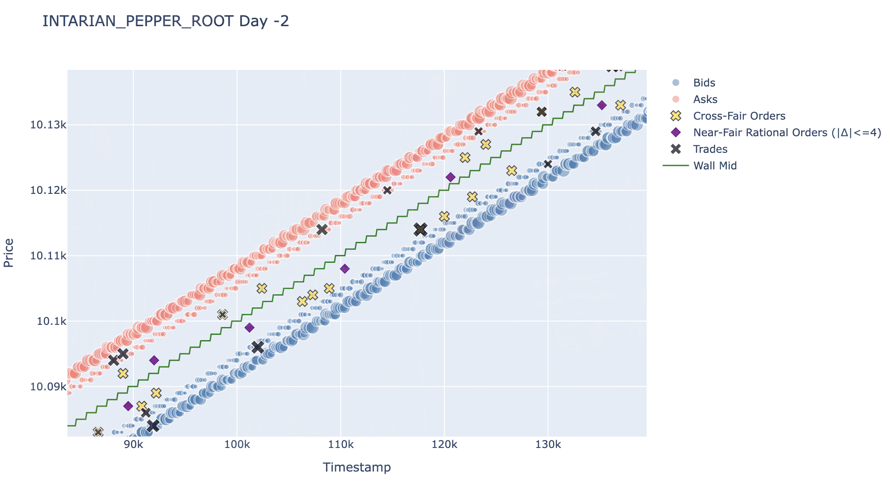
  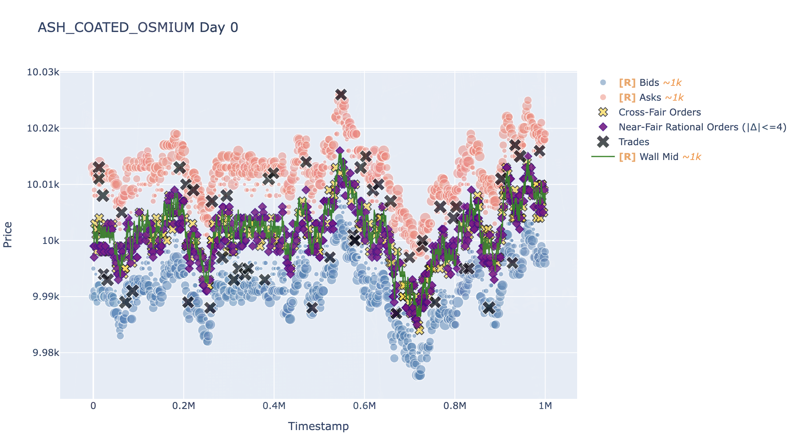
</p>

<p align="center"><i>Round 1 — ROOT(左)与 ASH(右)的微观结构。ROOT 呈严格线性单调递增,ASH 呈明显均值回归且 spread 较大。</i></p>

绘图后我们发现两个资产的微观行为高度异质:**ROOT 几乎是确定性线性增长,ASH 则在 10000 附近做明显的均值回归**。

更重要的发现是订单簿结构本身:**外层是大订单,内层穿插稀疏的小订单**——这暗示市场生成机制可能是先设定一个隐含 fair price、围绕它先撒外层大单,再后期插入内层小单。如果直接用 best bid/ask 中点做 fair price,会把内层订单的噪声当成价格变化。

这促使我们定义了 **双层 fair price 计算法**(后续多轮复用):

1. **Raw fair price**:取最大买单与最大卖单的中点;若单边没有挂单超过整数阈值 `n` 的订单,前向填充。
2. **校正后 fair price**:利用内层订单对 raw fair price 做二次去噪——把所有内层订单都拉到距 fair price 在 ±2 范围内。

<p align="center">
  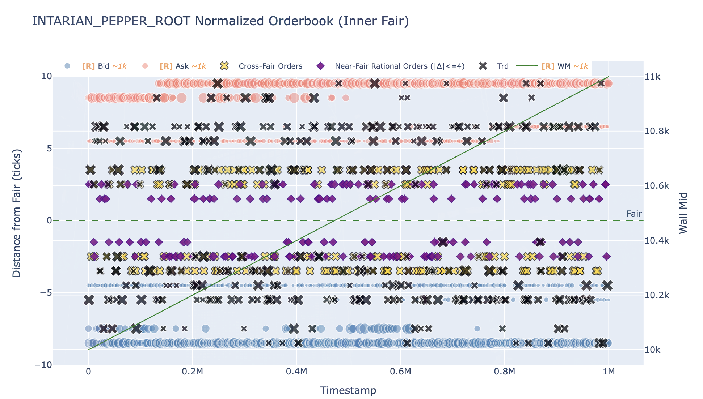
  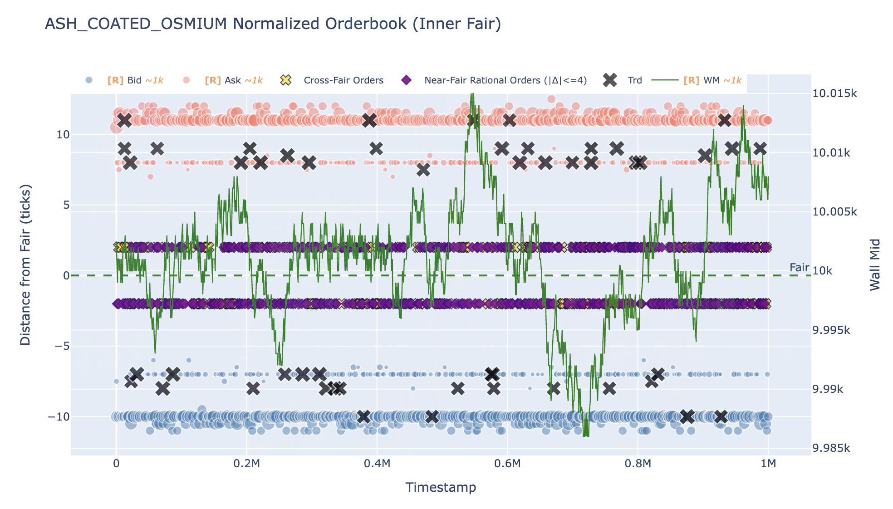
</p>

<p align="center"><i>Round 1 — Normalize 后的内层订单分布(ROOT 左、ASH 右)。把所有标记减去 raw fair price 后,ASH 的内层订单几乎严格落在 +1.5 与 −2.5 两条线上,说明 fair price 仍可被内层订单进一步校正。</i></p>

#### 假设

- **ROOT**:严格线性单调递增。
- **ASH**:由 OU 过程生成,长期均值约 10000。

我们针对 ASH 做了一套完整的统计验证流程:

1. **序列重构**:用上面的双层方法还原 inner fair price 序列。
2. **AR(1) 拟合**:把连续 OU 过程离散化为 AR(1),用线性回归提取长期均值与均值回归速度。
3. **ACF 交叉验证**:把 AR(1) 推出的理论半衰期与实际序列 ACF 的指数衰减速度对照——验证 OU 性质。
4. **噪声剥离**:抽出布朗运动项,确定基础波动率带宽。
5. **信号化**:基于稳态分布的实际方差构造 z-score。

<p align="center">
  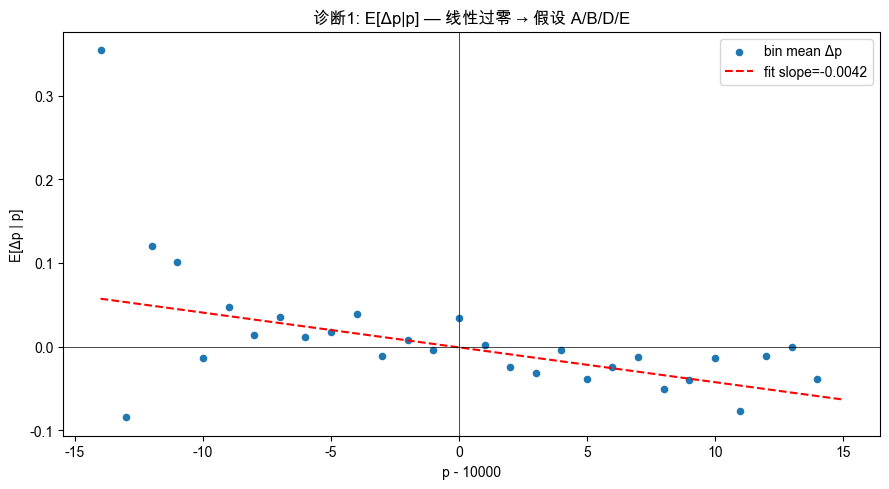
</p>

<p align="center"><i>Round 1 — ASH 均值回归验证。横轴为偏离 10000 的距离(分桶),纵轴为下一时刻平均变动。除最极端样本稀疏处外,数据严格落在一条斜率为负的直线上,印证 OU 假设。</i></p>

结果:OU 性质显著,但**噪声占据主导**——这是后续选择保守仓位管理的关键依据。

#### 策略选择与权衡

**ROOT 策略 — 两阶段:**

我们最初想"被动挂单做市 + 通过持仓吃漂移"两者兼得,设计了一个单调递增的目标仓位函数。但很快遇到两个问题:

1. **被动挂单调仓速度太慢**:主动成交远稀疏于挂单,被动建仓会错过开局优势价格。
2. **目标仓位函数极速饱和**:几乎立刻打满,后续无法对交易行为产生有效区分,反而引入大量到达率参数,破坏鲁棒性。

→ 改为两阶段:

- **阶段 1(快速建仓)**:这一阶段决定了大部分 PnL。我们写了大量冗余逻辑去极速锚定开局 fair price(处理各种单边缺失的边界情况),然后设定一个跨价阈值——只 take 价格优于 `fair_price + 阈值` 的订单,而非无脑吃单。这保证了**建仓速度**和**执行价格**双优。
- **阶段 2(收 spread)**:接近满仓后转入做市。固定阈值:满仓时挂被动卖单,一旦成交且总仓位低于阈值,立即 take 内层买单或挂被动买单回补,以最大化吃到正向漂移。

**ASH 策略 — 三档分级:**

基于 OU 模型给出的最优仓位函数,根据**当前仓位偏离最优仓位的程度**分三档:

| 偏离档位 | 外层逻辑 | 内层逻辑 |
|---|---|---|
| 小偏离 | 双边挂单(spread 大,这是 PnL 主要来源) | 双边 take 跨过 fair price 的非理性单 |
| 中偏离 | 双边挂单 | 单边 take(舍弃部分内层 take 收益换取风险敞口收紧) |
| 极端偏离 | 单边挂被动 | 单边 take(罕见情况) |

写好两个产品后,在自建回测上做超参数寻优(优先找参数高原而非全局最高点),然后提交。

#### 结果与复盘

**170 名。**

复盘后判断主要差距来自 **ASH 的极端偏离区段**:头部队伍**硬编码了极端偏离时的激进建仓逻辑**,在那一波极端波动里多吃了一段 PnL,直接拉开了名次。

> **关键反思**:我们的 OU 模型在统计意义上是对的,但"对所有偏离区段使用同一套参数化的最优仓位"过于均匀——在样本稀疏的尾部,模型本身的不确定性恰恰允许做更激进的人工干预。下一次我们会把"统计驱动 + 人工干预区段"显式拆成两层。

**关键文件**:
- 策略代码:[`prosperity/round1trade/final.py`](prosperity/round1trade/final.py)
- ASH 子策略:[`prosperity/round1trade/final_ash.py`](prosperity/round1trade/final_ash.py)、[`prosperity/round1trade/new_ash_strategy.md`](prosperity/round1trade/new_ash_strategy.md)
- ROOT 子策略:[`prosperity/round1trade/final_root.py`](prosperity/round1trade/final_root.py)、[`prosperity/round1trade/root_fair_calculate.md`](prosperity/round1trade/root_fair_calculate.md)
- 研究 notebook:[`prosperity/research_round12/ash_fair_reverse.ipynb`](prosperity/research_round12/ash_fair_reverse.ipynb)

---

### Round 2 — 加入出价竞拍博弈

**最终算法交易名次:77**

#### 市场观察

资产不变,引入新机制:**所有队伍要提交一个出价,出价最高的前 50% 可获得额外 25% 的市场 bot 成交,出价从总 PnL 里扣除**。

我们也注意到新进来的 bot 中**似乎隐含了价格变动信号**——但后续详细验证后发现其稳定性不足,不可作为可交易 alpha。

#### 假设

市场结构应延续:ROOT 继续线性,ASH 继续以同参数做均值回归。

#### 策略选择与权衡

**出价决策**:这是一个不完全信息博弈。我们在自建回测上对比了"加上额外成交"与"不加"两种情形——两天的 edge PnL 差距很大,一天 ~800,另一天接近 2000。

观察到 Discord 里有相当部分队伍声称要出 0 或个位数,我们最初定价 **102**(考虑到 100/101 的聚集效应)。但后来重新权衡风险:**一旦未拿到,损失 1000+ 的期望收益**。所以最终上调到 **151**——这相当于多出 50 来确保性获得额外成交,把这 50 当作风险溢价。

策略本体延续 Round 1。

#### 结果与复盘

**77 名(显著上升)**。事实上,即使出价 100 也能拿到——我们多付的 50 没有改变结果,但这是事前看可接受的成本。

**真正决定排名的不是出价**,而是另一件事:**ASH 的均值不再是 10000,出现了明显向下漂移**。

<p align="center">
  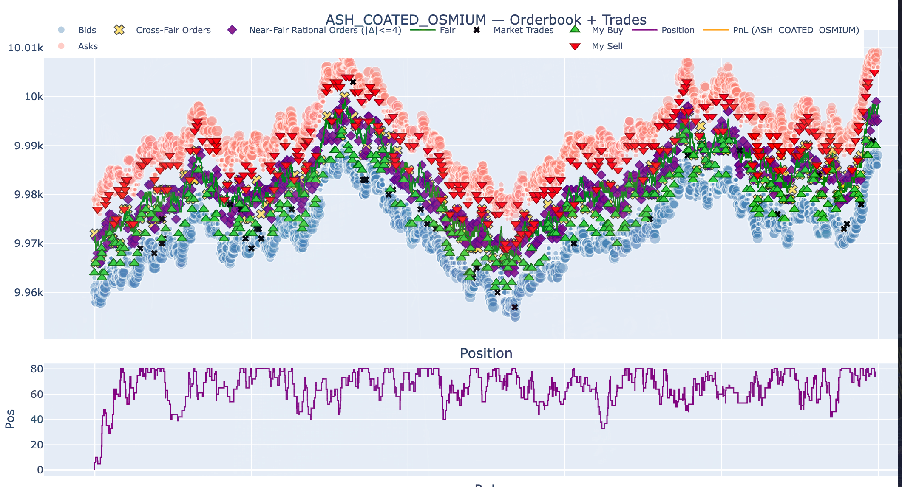
</p>

<p align="center"><i>Round 2 — ASH 实际成交回顾。可以看到价格中枢相比 Round 1 出现明显下移,我们的针对趋势保守的交易模式在分布漂移下损失了一部分交易机会，扩大了风险暴露，但是相比于其他同水平队伍损失更小。</i></p>

<p align="center">
  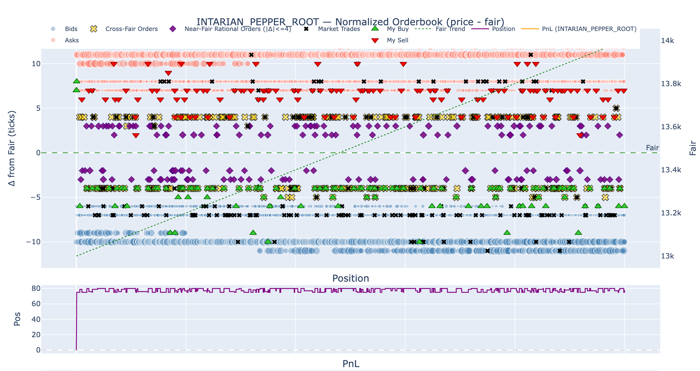
</p>

<p align="center"><i>Round 2 — ROOT 在 normalize 视角下的交易结果。两阶段策略的"快速建仓 + 满仓做市"形态清晰可见。</i></p>

我们的均值回归策略仓位偏保守、在高仓位做双边交易——表面上看，这增加了方差、放弃了一部分趋势机会。但 Round 1 里激进硬编码极端偏离逻辑的头部队伍,**正因为"打满仓位"这一动作,在 ASH 均值漂移时损失更严重**。

> **这不是我们策略对、是别人错——而是我们的保守正好对冲了我们没识别出的均值漂移风险。这种"侥幸"我们记下来了**:它说明我们当时缺少对参数稳定性(`mu` 是否真的恒定 10000?)的持续监控。下次会显式加上一个分布漂移检测。

**关键文件**:[`prosperity/round2trade/final2.py`](prosperity/round2trade/final2.py)

---

### Round 3 — 期权 + 现货

**最终算法交易名次:95(Phase 2 重置后)**

#### 市场观察

进入 Phase 2,引入期权,这是我们相对陌生的领域,且每轮时间缩短到 48h。

**资产**:
- 现货:`HYDROGEL_PACK` (PACK)、`VELVETFRUIT_EXTRACT` (FRUIT),仓位限制 ±200。
- FRUIT 看涨期权 10 档:VEV_4000(深度实值,价格 ≈ FRUIT − K)、VEV_4500、VEV_5000、VEV_5100、VEV_5200、VEV_5300、VEV_5400、VEV_5500(接近平值)、VEV_6000、VEV_6500(深度虚值,价格为 0,无法买入)。每档仓位限制 ±300。

只有 PACK、FRUIT、VEV_4000 存在双边主动成交,其他要么单边要么完全没有,**做市机会大幅削弱,需要主动 take 管理仓位**——这与前两轮的结构截然不同。

#### 假设的演化

我们尝试了三个方向,最后两个被否决:

1. ❌ **隐含 ETF 关系**(PACK 是否是某些期权的复合?):回归 R² 太小,推翻。
2. ❌ **PACK = β·FRUIT + 布朗噪声**:观察到前期同步、后期发散,但参数过多、证据不足以转化为 alpha。
3. ❌ **波动率曲面套利**:绘了 IV surface(见 `prosperity/vev_plot/`)、剔除异常档进行拟合,但发现 IV 长期偏离曲面,回归速率不足以跨越 spread。完整的 IV 曲面构造与拟合过程见 [`prosperity/round3research/option_research.ipynb`](prosperity/round3research/option_research.ipynb)。
4. ✅ **全资产做均值回归**:最终发现**所有资产本身**都呈现明显的均值回归,且回归速度足够快、偏离幅度足够大——这成了我们的核心 alpha 来源。

#### 策略选择与权衡

均值回归在短周期内做 z-score 容易因为预热数据不足而失真。我们做了两个工程化决策:

- **不用 z-score,用价格相对长周期 EMA 的绝对偏离**触发交易(放弃滚动 sigma)。
- **预先输入参考 EMA**缓解冷启动。

执行层面,对三个有双边主动成交的资产(PACK、FRUIT、VEV_4000)同时叠加做市逻辑;对其他期权,主动 take 仍带阈值限制以避免过度交易。

<p align="center">
  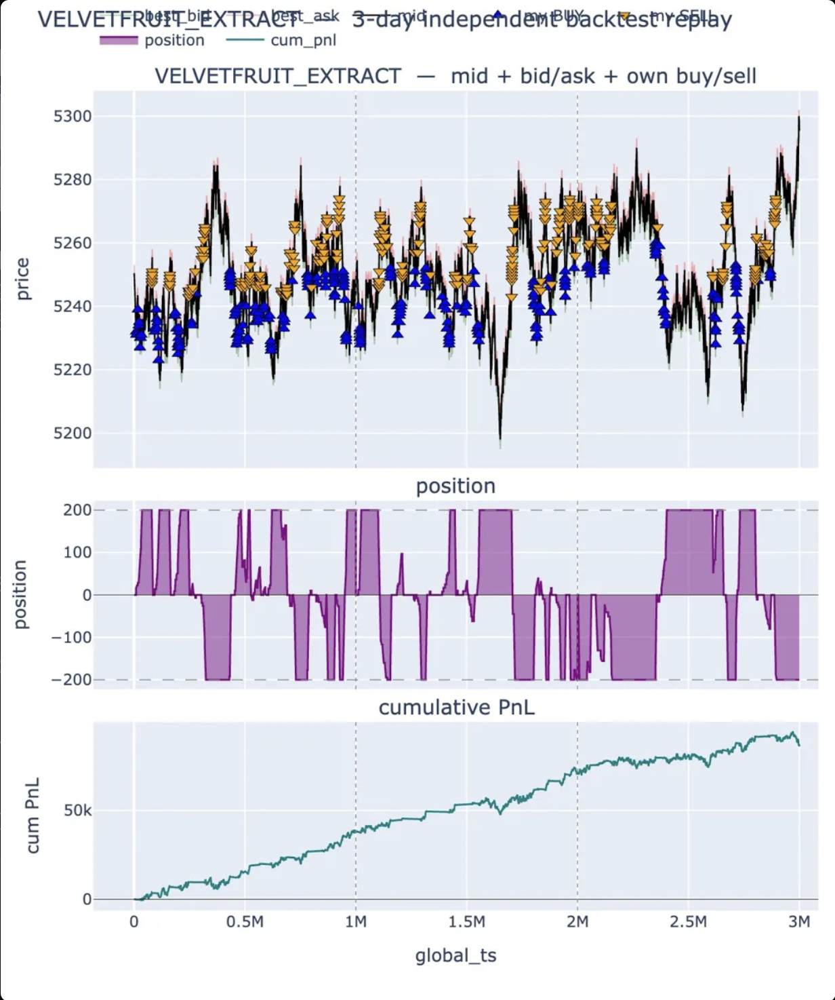
</p>

<p align="center"><i>Round 3 — FRUIT 交易结果。EMA 偏离触发的均值回归交易在波动剧烈的市场中保持了较稳定的执行节奏。</i></p>

#### 结果与复盘

**95 名** 这一轮整体波动巨大——很多做 Gamma Scalping 的队伍回测亮眼但实盘崩了。和我们同水平的队伍大多也选择了"放弃跨资产关系、统一做均值回归",**保证了策略可解释性和逻辑互不冲突**。

> **事后反思**:我忽略了内层订单的处理。Round 1 我们就在 ASH 上验证过"用内层订单校正 fair price"的有效性,**但 Round 3 因为 spread 较小就懒得做这一层,直接放弃了零成本调仓的机会**。如果当时把 ASH 那套思路迁移过来,在期权上做更精准的 fair price + 内层 take,持仓 PnL 会显著更稳。这是我自己工作流上的失误。

**关键文件**:
- 策略代码:[`prosperity/round3trade/激进_best.py`](prosperity/round3trade/激进_best.py)
- 期权研究:[`prosperity/round3research/option_research.ipynb`](prosperity/round3research/option_research.ipynb)(包含完整的 IV surface 构造与拟合过程)
- 均值回归验证:[`prosperity/round3research/reversion_research.ipynb`](prosperity/round3research/reversion_research.ipynb)、[`prosperity/round3research/round3_validation.ipynb`](prosperity/round3research/round3_validation.ipynb)

---

### Round 4 — 披露 Bot 名,跟单挖掘

**最终算法交易名次:132**

#### 市场观察

市场与 Round 3 完全相同,但**主办方披露了每笔成交双方的 bot 名称**——这是显然的提示:bot 的身份里可能有信息。

#### 假设与验证

> **关键的研究方法是:不轻信"看起来聪明"的 bot,而是用一个量化判据筛**。

第一步:对每个 bot 的成交在图上做标记 + 计算各自的持仓 PnL。结果发现**所有 bot 的持仓 PnL 都在 0 附近随机游走**——直接看 PnL 看不出谁聪明。

第二步(关键):**按"bot 成交时价格相对 EMA 的偏离程度"分桶**,在每个桶内,只看方向正确的成交,对比该 bot 的成交价 vs. 该桶的平均成交价是否更优。

结果:**Mark 14 与 Mark 55** 在不同程度的偏离区都显著更优,Mark 55 尤其稳定。这是两个真正的 informed bot。完整分析见 [`prosperity/round4research/bot_analysis.ipynb`](prosperity/round4research/bot_analysis.ipynb) 与 [`prosperity/round4research/bot_recognize.md`](prosperity/round4research/bot_recognize.md)。

#### 策略选择与权衡

在 Round 3 策略基础上叠加跟单逻辑:每次进入可开仓阈值区间时,**不直接开仓,而是等待 Mark 14 / Mark 55 的成交,再跟随**。引入两个参数:
- 一次跟单最多吃多少仓位
- 进入开仓区间后,从第几个订单开始跟单

回测显示能稳定优化执行,但**带来的 alpha 有限**。

#### 结果与复盘

**132 名(从 95 下滑)**。PnL 明显低于上一轮。

> **我对这个下滑的归因是:策略迁移惯性 + 风险叠加**。所有高度相关的资产用同一套均值回归逻辑,会**在所有资产上同时方向一致地建仓**——这放大了系统性敞口。Round 3 这个问题就存在,只是市场友好;Round 4 市场结构稍变,问题就暴露了。

**关键文件**:
- 策略代码:[`prosperity/round4trade/慢跟单.py`](prosperity/round4trade/慢跟单.py)
- 研究 notebook:[`prosperity/round4research/bot_analysis.ipynb`](prosperity/round4research/bot_analysis.ipynb)
- 信号验证:[`prosperity/round4research/bot_recognize.md`](prosperity/round4research/bot_recognize.md)、[`prosperity/round4research/trader_signal_validation.md`](prosperity/round4research/trader_signal_validation.md)

---

### Round 5 — 50 资产,复杂跨资产结构

**最终算法交易名次:96**

#### 市场观察

10 组资产,每组 5 个,共 **50 个资产**。每个资产仓位限制 ±10。题面提示:**部分资产可能优于其他**——意思是,我们要从 50 个资产里识别出哪些不是"普通几何布朗运动",从中挖 alpha。

#### 整体研究框架

> 50 个资产,直接看图必然有部分"看起来有规律"的——这是过拟合的温床。**我们设的纪律是:只在多重独立证据都支持时,才针对性挖 alpha**。

最终我们识别出 **三个独立 alpha**(其中两个利用了,第三个 **被我们错误判断为不可交易**):

1. ✅ **PEBBLE 组的 ETF 完全镜像** — 配对做市 + 内层零成本调仓。
2. ✅ **SNACK 组的多资产相关结构** — 配对 + 单资产均值回归组合。
3. ❌ **整百价格弹跳的高频均值回归** — 数学结构识别清楚,但被错误观念屏蔽,未利用。

#### 三个 Alpha 的独立验证过程

**Alpha 1:PEBBLE 组的 ETF 完全镜像**

Mike 对 50 个资产的**收益率相关系数**做了热力图:
- PEBBLE 组的 XL 资产与同组其他资产存在 **−0.5 的相关性**;
- SNACK 组内资产呈高度正负相关结构;
- **其余所有资产的收益率相关系数严格等于零**。

<p align="center">
  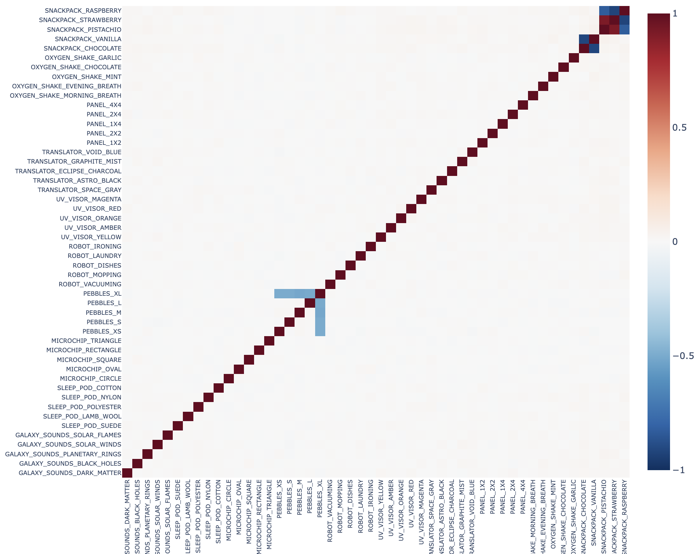
</p>

<p align="center"><i>Round 5 — 50 资产收益率相关系数热力图。仅 PEBBLE 与 SNACK 组内呈现非零相关结构,其余组别相关系数严格为零。</i></p>

我对各组**价格本身**做回归:**PEBBLE 组的 R² 严格等于 1**——也就是 5 个资产的某种线性组合是常数。进一步研究确认:**PEBBLE 组所有资产相加 = 50000**,严格相等。

这意味着**没有错误定价 alpha,但配对可以极大降低方差**。

更震惊的发现来自把 Round 1 的双层 fair price 方法迁移过来:**当我把所有内层订单严格拉到 fair price 处时,同一组、甚至相邻组的多个资产,内层订单序列完全一致**——出现时间、订单方向、订单大小,全部同步。

> **这一发现回收了 Round 1 的猜想——内外层订单确实是分别生成的,内层是后期插入的**。无论这是主办方的彩蛋还是无意泄漏的信息,它都使得 PEBBLE 组可以做**完全同步的零成本对冲调仓**,持仓 PnL 几乎严格归零、纯做交易 PnL。

**Alpha 2:SNACK 组的相关结构**

Mike 进一步发现:在 SNACK 组中,**巧克力与香草高度负相关**;**草莓 ≈ 树莓的反转 + 向上漂移**;**开心果 ≈ 树莓的反转 + 向下漂移**。

我用回归验证:草莓的波动幅度 ≈ 树莓,开心果 ≈ 树莓的一半,且三者都有显著的均值回归效应。

**Alpha 3(被错过的那个):整百价格弹跳**

部分资产在某些时段会**在整百价格上弹跳**,但 spread 不变、整体波动不变。我用三种独立方法验证了这个结构:

<p align="center">
  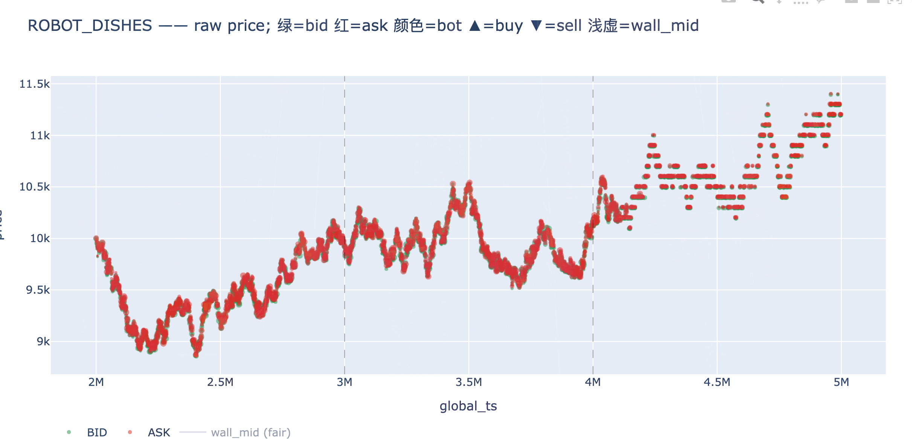
</p>

<p align="center"><i>验证 (1):直接绘订单/价格图。可以清晰看到价格序列贴附整百格点。</i></p>

<p align="center">
  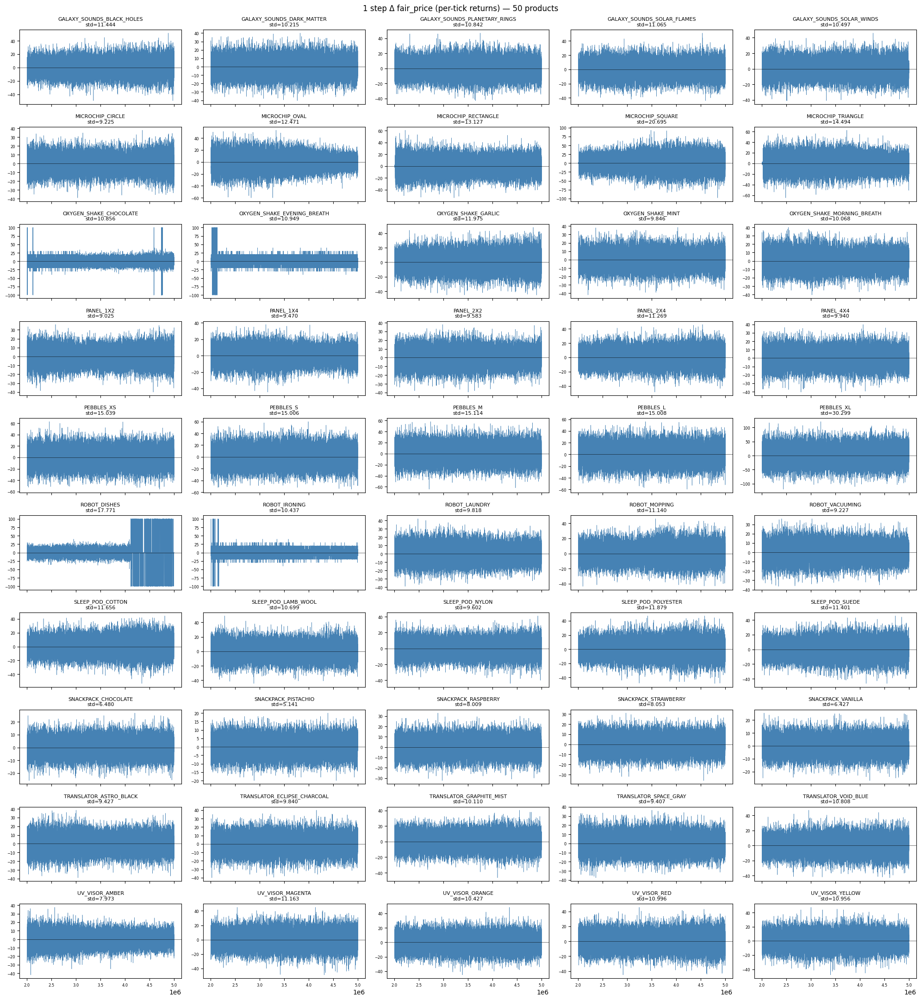
</p>

<p align="center"><i>验证 (2):一阶差分折线图。差分呈现离散的 ±100 跳动,而非连续小幅变动。</i></p>

<p align="center">
  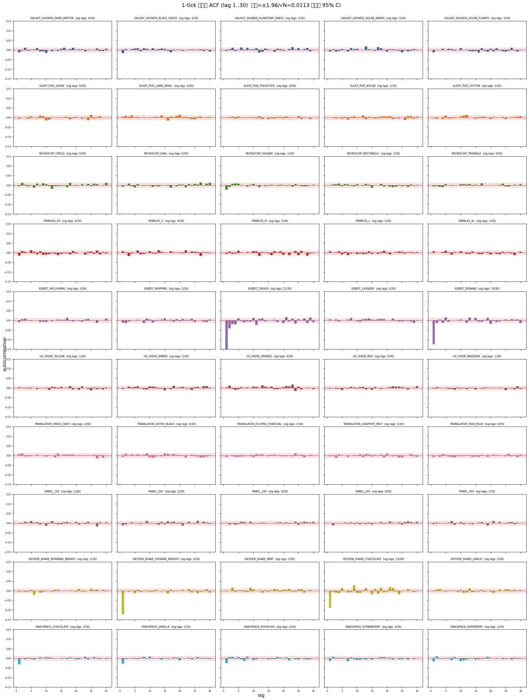
</p>

<p align="center"><i>验证 (3):ACF 图。lag-1 显著为负,与离散化产生的负相关结构吻合。</i></p>

三种方法结论一致,**这是几何布朗运动投影到整百格点的产物**,在文献中(如 Roll 的论文)有理论解释。

#### 策略选择

- **PEBBLE 组**:配对做市——外层挂单赚 spread,内层 take 实现零成本平仓。优先压风险敞口、其次压单资产仓位。
- **SNACK 组**:巧克力/香草沿用 PEBBLE 模式;树莓做 EMA 均值回归;草莓做正向持仓 + 均值回归;开心果做负向持仓 + 均值回归。
- **其他资产**:全部按"几何布朗运动 + 无 alpha"处理——外层挂单做市、内层零成本平仓,避免过拟合。

PEBBLE 配对策略实测**持仓 PnL 几乎严格为零,交易 PnL 直线上升**,这是这一轮最干净的 alpha 实现:

<p align="center">
  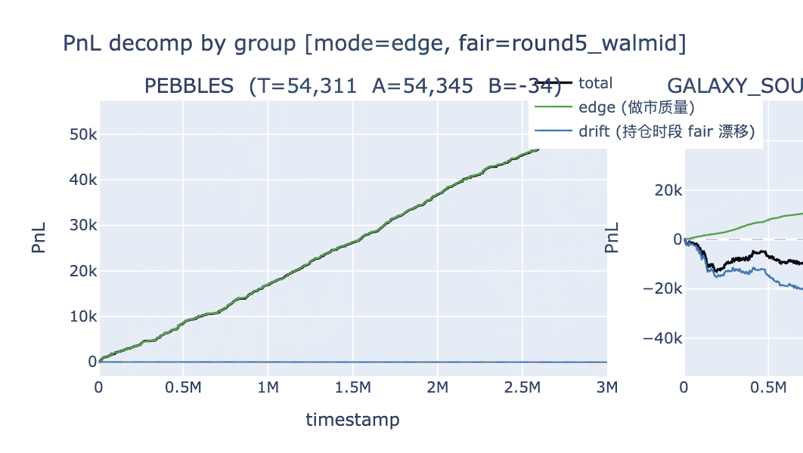
</p>

<p align="center"><i>Round 5 — PEBBLE 配对策略 PnL 分解。可以看到持仓 PnL 在零附近窄幅波动,而交易 PnL 稳步累积——这是配对结构 + 内层零成本调仓共同作用的结果。</i></p>

#### 结果与最大复盘:为什么错过了 Alpha 3

> **这一节是这份 README 里我最想让读者读的一节**。

最终结果，算法排名**96**。

我认为能够回升主要由三个原因推动：

**1.** 发现了两个alpha，Mike在此，特别是SNACK部分功不可没。 

**2.** 没有给其他的资产进行强行趋势化解释，我依旧认为大部分资产是几何布朗运动，在过去三天，部分资产因为巧合而展示出类似趋势的形态。可能有部分队伍将趋势当成了alpha，这会导致回测结果很好但是最终跑出来结果很差。

**3.** 可能存在个别队伍没有充分利用好全部资产，可能选择放弃部分资产的交易，因为他们忽略了虽然单个资产波动远大于spread，但是数十个布朗运动会产生方差抵消，在这些资产的交易中，收益是线性累加的，而独立随机波动的风险是按平方根增加的。

但是我们没能回升更快的原因则是因为我们**遗漏了重要alpha**：

在出结果前我通过 Discord 讨论我立刻意识到自己**漏了一个本可以独占的 alpha**:**整百弹跳区段的高频均值回归**。

我已经识别出了结构、用三种方法验证了数学原理——**为什么没去交易它?** 两条惯性观念把我屏蔽了:

1. **"几何布朗运动本身不产生 alpha"** — 这是对的,但**投影到整百格点的过程不是几何布朗运动,而是离散化引入的额外结构**。我把"原过程无 alpha"错误外推到"投影后也无 alpha"。
2. **"ACF lag-1 显著为负是不可交易信号,因为它瞬间消失"** — 这在前几轮市场里是对的,因为单步回归收益跨不过 spread。**但在这一轮,资产单步跳动幅度已经接近 spread 的 10 倍**——回归收益完全可以跨越 spread 的成本。我没注意到环境参数已经变了,旧观念失效了。

事后看到群里的交易结构图,我立刻明白了正确做法:**只要价格上跳 100 就全仓卖出,只要下跳 100 就全仓买入**。这是这一轮我能想象到的最简单、最干净的 alpha,而且**我有所有需要的数据和验证,只缺一个跨过既有观念的瞬间**。


> ### 赛后反事实推演 (Post-result counterfactual)
> 在撰写这篇复盘的初版时，我就知道这是一个错失的 alpha，但当时还未意识到它实际的经济体量。在重构策略并在最终轮的设定下进行回放后，得出的结论尤为残酷：仅仅加上这一层 lattice-reversal 逻辑，就很可能将我们的算法排名从第 96 名大幅拉升至 Top-15 区间。
> 这彻底改变了我对这个失误的定性。它绝不仅仅是一个无足轻重的次要观察，而是我们 Round 5 提交中占据绝对主导的机会成本。
>
> 这里面一个关键的认知差在于，这个 alpha 的实际变现价值，极大程度上取决于官方评估环境究竟给这个微观结构效应分配了多大的利润空间（edge）。在样本内（in-sample），我完全看透了它的数学结构；但事后（ex post）官方数据的分布揭示，这个结构所给予的奖励远远超出了我当时的假设。

> **这是我认为这次比赛对我最有价值的教训**:
> - 研究纪律("多证据再行动")在面对**有效信号**时是好习惯;
> - 但同样的纪律在面对**已经验证过结构的现象**时,会变成思维惰性;
> - **当原有观念($A \Rightarrow \text{no alpha}$)依赖某些环境参数(spread、跳动幅度)时,要在每轮显式重新检查这些参数是否仍然成立**,不能把跨轮的结论直接复用。
>
> 这也呼应了[总复盘](#总复盘)里关于"两人讨论容易在错误观念上达成共识"的一点——我和 Mike 都同意这个不是 alpha,我们的共识强化了错误。

**关键文件**:
- 策略代码:[`prosperity/round5trade/version1.py`](prosperity/round5trade/version1.py)
- PEBBLE 配对做市:[`prosperity/round5trade/make_pebble.py`](prosperity/round5trade/make_pebble.py)、[`prosperity/round5trade/PEBBLES_做市与对冲算法规范.md`](prosperity/round5trade/PEBBLES_做市与对冲算法规范.md)
- SNACK 策略:[`prosperity/round5trade/SNACK.py`](prosperity/round5trade/SNACK.py)、[`prosperity/round5trade/SNACKPACK_策略规范.md`](prosperity/round5trade/SNACKPACK_策略规范.md)
- 研究 notebook:[`prosperity/round5research/etf_regression.ipynb`](prosperity/round5research/etf_regression.ipynb)、[`prosperity/round5research/explore_round5.ipynb`](prosperity/round5research/explore_round5.ipynb)
- 题目原文:[`prosperity/round5research/ETF_回归分析方案.md`](prosperity/round5research/ETF_回归分析方案.md)

---

## 总复盘

### 工作流的局限性

我们的工作流是 **"人脑 + AI 反复讨论 → 人脑设计规范 → AI 落地代码"**。这种模式有两个清晰的局限:

**1. 大模型有"老生常谈倾向"**

LLM 因为基于全网数据训练,讨论策略方向时**总会回到微观结构不平衡信号、延迟处理、队列优先级**等通用话题——即使我用 `Claude.md` 把比赛特殊规则写进去,它仍倾向于把问题向标准做市/做雄方向"复杂化",而不是针对当前市场的真实结构去找局部 alpha。

**2. 两人讨论会强化共同错误**

当人脑和 AI 反复对齐到一个共识时,如果共识本身是错的(比如 Round 5 我先入为主认为整百弹跳无 alpha，AI对此表示认同),**讨论本身会让错误更牢固**。要打破这种,需要**多个能独立产出 alpha 的人参与对抗性讨论**。这次比赛就是两人队的局限。

### 工具链的债务

**回测框架五轮共用**——这在前期是节省时间的,但到 Round 5 时,五轮市场差异巨大累积下来的逻辑分支让框架变得臃肿,每次让 Claude 处理时 token 消耗也越来越大。下次重打,我会:

- 在每轮开始时为该轮市场写**轻量的 ad-hoc 回测器**(只覆盖本轮需要的资产/机制),
- 通用回测器只承担"撮合机制"这一层最稳定的部分。

### 与最顶级选手的差距

我认为差距主要在 **深层信号的利用**:

- 顶级选手能在普通选手都看到的现象之上,**多挖出一两个非显然的 alpha**(比如 Round 1 ASH 极端偏离的硬编码、Round 5 的整百弹跳),这些 alpha 单独看 PnL 贡献不一定大,但**头部之间的差距正是由这些"次显然 alpha"的累计构成的**。
- 我自己的弱点是**研究纪律和反惯性的平衡**:我有较好的多证据交叉验证习惯(避免过拟合),但 Round 5 暴露出我对自己已建立观念的反思频率不够,**没有定期问"这个观念依赖哪些环境参数,本轮还成立吗?"**。

### 我从中学到的

- **每轮显式重检跨轮假设**(尤其是当环境参数——spread、波动率、tick——发生数量级变化时)。
- **回测框架轻重分离**:稳定核心 + 轮次专用层。
- **多人独立讨论的价值**——共识不一定是真理,有时只是同向偏差的累积。
- **复盘要写在原始研究文档里**,而不是只存在于事后回忆中。这个仓库的 `.md` 规范文档实际上就是这个习惯的产物。

---

*如有任何讨论交流,欢迎通过上方联系方式联系。*
